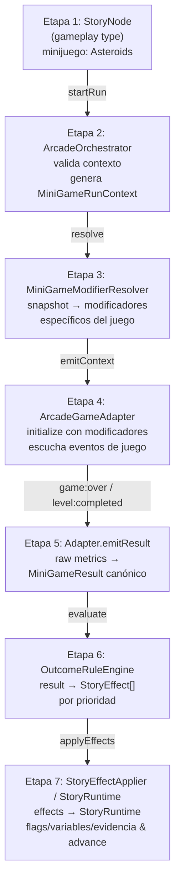

# Pipeline Narrativo-Gameplay: 7 Etapas

Este documento describe la arquitectura del pipeline de integración entre la narrativa data-driven y el motor de juegos arcade de TinyAster.

## Diagrama Conceptual (Mermaid)



---

## Desglose Etapa por Etapa

### Etapa 1: StoryNode (Definición Declarativa)
- **Responsabilidad:** Definir el encuentro narrativo dentro del grafo (`StoryGraph`).
- **Input:** Configuración del nodo de tipo `"gameplay"`.
- **Output:** Nodo activo con metadatos de encuentro (`encounterId`).
- **Pseudocódigo:**
  ```typescript
  const node: StoryNode = {
    id: "act1_asteroids_gameplay",
    type: "gameplay",
    sceneToLoad: "asteroids-story-mode-lv3",
    meta: { minijuego: "asteroids", encounterId: "poc-asteroids-1" },
    objective: { id: "survive-asteroids-wave3", targetCount: 3, currentCount: 0, completed: false },
    transitions: [{ targetNodeId: "eval_act1_performance" }]
  };
  ```

### Etapa 2: ArcadeOrchestrator.startRun()
- **Responsabilidad:** Validar el estado del orquestador, crear el contexto inmutable `MiniGameRunContext` con seed determinista y notificar a la máquina de estados (`ArcadeKernel`).
- **Input:** `MiniGameEncounter` y `StoryRuntimeSnapshot`.
- **Output:** Instancia de `MiniGameRunContext`.
- **Pseudocódigo:**
  ```typescript
  const runContext = orchestrator.startRun(
    asteroidsPOCEncounter,
    storyRuntime.getStateSnapshot()
  );
  ```

### Etapa 3: MiniGameModifierResolver
- **Responsabilidad:** Evaluar las reglas declarativas `modifierRules` sobre el snapshot narrativo actual sin mutar estado.
- **Input:** Snapshot de `StoryRuntime` + `ModifierRule[]`.
- **Output:** Lista de `MiniGameModifier` (ej. `shieldMultiplier`, `navigationAssist`).
- **Pseudocódigo:**
  ```typescript
  const modifiers = modifierRules
    .filter(rule => rule.condition(snapshot))
    .map(rule => rule.modifier);
  ```

### Etapa 4: ArcadeGameAdapter.initialize()
- **Responsabilidad:** Instanciar la partida del minijuego concreto (`AsteroidsGame` / `SpaceInvadersGame`), aplicar los modificadores mecánicos en el motor ECS y suscribirse a eventos de victoria/derrota.
- **Input:** `MiniGameRunContext` y contenedor DOM/Canvas.
- **Output:** Instancia activa del minijuego ejecutándose a 60 FPS.
- **Pseudocódigo:**
  ```typescript
  adapter.initialize(runContext, hostElement);
  // Aplica: game.shieldMultiplier = 1.5; game.navigationAssist = false;
  ```

### Etapa 5: Adapter.emitResult()
- **Responsabilidad:** Mapear las métricas de rendimiento brutas del juego (puntuación, tiempo, colisiones, secretos) a un objeto `MiniGameResult` canónico.
- **Input:** Evento de finalización de juego (`game:over` / `level:completed`).
- **Output:** Estructura unificada `MiniGameResult`.
- **Pseudocódigo:**
  ```typescript
  const result: MiniGameResult = {
    runId: context.runId,
    gameId: "asteroids",
    score: 1500,
    completed: true,
    durationMs: 42000,
    metrics: { collisions: 0, asteroidsDestroyed: 18 },
    secretsFound: []
  };
  ```

### Etapa 6: OutcomeRuleEngine.evaluate()
- **Responsabilidad:** Evaluar las `outcomeRules` del encuentro contra el `MiniGameResult` por orden de prioridad y compilar los `StoryEffect[]` resultantes.
- **Input:** `MiniGameResult` + `MiniGameOutcomeRule[]`.
- **Output:** Conjunto de efectos declarativos (`setFlag`, `incrementVariable`, `discoverEvidence`).
- **Pseudocódigo:**
  ```typescript
  const effects = ruleEngine.evaluate(result, encounter.outcomeRules);
  // Genera: [{ type: "setFlag", key: "asteroidsPerfect", value: true }, { type: "setFlag", key: "heroicEntry", value: true }]
  ```

### Etapa 7: StoryEffectApplier y StoryRuntime.evaluateTransitions()
- **Responsabilidad:** Aplicar los efectos en `StoryRuntime`, mutar flags/variables y evaluar transiciones salientes para avanzar al siguiente nodo del grafo (`story:node_changed`).
- **Input:** `StoryEffect[]`.
- **Output:** Nuevo nodo activo en el grafo narrativo.
- **Pseudocódigo:**
  ```typescript
  StoryEffectApplier.applyEffects(storyRuntime, effects);
  storyRuntime.evaluateTransitions(); // Transiciona a "cutscene_trans_to_spaceinvaders"
  ```

---

## Tabla de Transformación de Datos

| Etapa | Estructura Entrante | Transformación Principal | Estructura Saliente |
|-------|--------------------|--------------------------|---------------------|
| 1 | `StoryGraph` | Selección de nodo actual | `StoryNode` |
| 2 | `StoryNode` + `MiniGameEncounter` | Validación y generación de contexto | `MiniGameRunContext` |
| 3 | `StoryRuntimeSnapshot` | Evaluación de predicados de modificador | `MiniGameModifier[]` |
| 4 | `MiniGameRunContext` | Inyección de parámetros mecánicos en ECS | Instancia de Juego Activa |
| 5 | Métricas ECS Brutas | Canonización de datos de sesión | `MiniGameResult` |
| 6 | `MiniGameResult` | Evaluación DSL de condiciones | `StoryEffect[]` |
| 7 | `StoryEffect[]` | Mutación de estado y salto de nodo | `StoryState` actualizado |

---

## Ejemplo End-to-End: Flawless Run

1. **Asteroids Act 1:** Jugador completa el nivel 3 de Asteroids sin perder vidas (`completed = true`, `score = 1500`).
2. **Resultado de Reglas:** `OutcomeRuleEngine` setea `asteroidsPerfect = true` y `heroicEntry = true`.
3. **Transición:** El orquestador transiciona al corte narrativo `cutscene_trans_to_spaceinvaders`.
4. **Space Invaders Act 2:** `MiniGameModifierResolver` lee `heroicEntry = true` y aplica handicap: `extraLives = 0`, `fireRateMultiplier = 1.0`.
5. **Resultado Space Invaders:** Jugador obtiene `score = 6200 (> 5000)` → `OutcomeRuleEngine` setea `reinforcementsReceived = true`.
6. **Asteroids Redux Act 3:** `MiniGameModifierResolver` lee `reinforcementsReceived = true` y aplica bonificación: `shieldMultiplier = 1.5`.
7. **Final:** El nodo `final_evaluation_branch` evalúa `heroicEntry == true` Y `reinforcementsReceived == true`, desbloqueando el final **"Flawless Victory"**.
