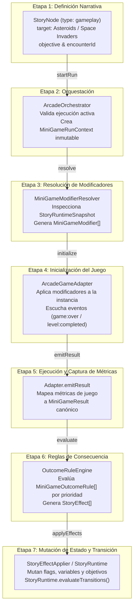

# Pipeline Narrativo-Gameplay de 7 Etapas

Este documento describe la arquitectura declarativa de 7 etapas que interconecta el motor narrativo `StoryRuntime` con las sesiones de minijuegos arcade en **TinyAster**.

---

## Diagrama Flujo Conceptual (Mermaid)



---

## Desglose Etapa por Etapa

### Etapa 1: StoryNode (Definición Declarativa)
* **Responsabilidad:** Declarar el encuentro de juego dentro del grafo narrativo (`StoryGraph`).
* **Input:** Grafo narrativo cargado en `StoryRuntime`.
* **Output:** Objeto `StoryNode` activo de tipo `"gameplay"`.
* **Tipos involucrados:** `StoryNode` (`packages/core/src/story/StoryTypes.ts`)
* **Código:**
```typescript
{
  id: "poc_act1_asteroids",
  type: "gameplay",
  title: "Act 1: Asteroids Debris Sweep",
  sceneToLoad: "asteroids-story-mode-lv3",
  meta: {
    gameId: "asteroids",
    encounterId: "poc-asteroids-1"
  },
  objective: {
    id: "obj_asteroids_sweep",
    eventKey: "level:completed",
    titleKey: "story.poc.obj_asteroids_title",
    descriptionKey: "story.poc.obj_asteroids_desc",
    targetCount: 3,
    currentCount: 0,
    completed: false
  },
  transitions: [
    {
      targetNodeId: "poc_act1_check",
      condition: { type: "objective", key: "obj_asteroids_sweep" }
    }
  ]
}
```

---

### Etapa 2: ArcadeOrchestrator (Contexto Inmutable de Ejecución)
* **Responsabilidad:** Garantizar aislamiento de estado, evitar ejecuciones simultáneas y generar una semilla determinista junto con el snapshot del runtime narrativo.
* **Input:** `MiniGameEncounter`, `StoryRuntimeSnapshot`.
* **Output:** Objeto `MiniGameRunContext`.
* **Tipos involucrados:** `MiniGameRunContext`, `ArcadeOrchestrator` (`packages/core/src/story/ArcadeOrchestrator.ts`)
* **Código:**
```typescript
const runContext: MiniGameRunContext = orchestrator.startRun(
  asteroidsPOCEncounter,
  storyRuntime.getState()
);
```

---

### Etapa 3: MiniGameModifierResolver (Modificadores Mecánicos)
* **Responsabilidad:** Evaluar las condiciones narrativas (`ModifierRule[]`) contra el snapshot del `StoryRuntime` para producir modificadores aplicables al minijuego sin acoplar la lógica del juego al motor narrativo.
* **Input:** `StoryRuntimeSnapshot`, `MiniGameEncounter`.
* **Output:** Array `MiniGameModifier[]`.
* **Tipos involucrados:** `MiniGameModifierResolver`, `MiniGameModifier` (`packages/core/src/story/MiniGameModifierResolver.ts`)
* **Código:**
```typescript
const resolver = new MiniGameModifierResolver();
const activeModifiers = resolver.resolve(storyRuntime.getState(), spaceInvadersPOCEncounter);
// Resultado: [{ targetProperty: "extraLives", value: 2 }, { targetProperty: "fireRateMultiplier", value: 1.3 }]
```

---

### Etapa 4: ArcadeGameAdapter (Inicialización y Enlace de Eventos)
* **Responsabilidad:** Instanciar el juego (ej. `AsteroidsGame` o `SpaceInvadersGame`), aplicar los modificadores recibidos a las propiedades del mundo o jugador, y registrar listeners para eventos de término (`game:over`, `level:completed`).
* **Input:** `MiniGameRunContext`, `HTMLElement` (host contenedor).
* **Output:** Instancia de juego activa en loop de renderizado.
* **Tipos involucrados:** `ArcadeGameAdapter` (`packages/core/src/story/ArcadeGameAdapter.ts`)
* **Código:**
```typescript
export class SpaceInvadersArcadeAdapter implements ArcadeGameAdapter {
  public initialize(context: MiniGameRunContext, host: HTMLElement): void {
    const game = new SpaceInvadersGame({ seed: context.seed });
    for (const mod of context.modifiers) {
      if (mod.targetProperty === "extraLives") (game as any).extraLives = mod.value;
      if (mod.targetProperty === "fireRateMultiplier") (game as any).fireRateMultiplier = mod.value;
    }
    game.start();
  }
}
```

---

### Etapa 5: Metric Capture & Canonical MiniGameResult
* **Responsabilidad:** Traducir las métricas de gameplay brutas (puntuación, colisiones, enemigos destruidos, secretos hallados) a una estructura canónica estandarizada.
* **Input:** Eventos de gameplay o estado final del controlador de juego.
* **Output:** Objeto canónico `MiniGameResult`.
* **Tipos involucrados:** `MiniGameResult` (`packages/core/src/story/ArcadeIntegrationTypes.ts`)
* **Código:**
```typescript
const result: MiniGameResult = {
  runId: context.runId,
  gameId: "space-invaders",
  score: rawPayload.score,
  completed: rawPayload.score >= 5000,
  durationMs: rawPayload.durationMs,
  metrics: {
    invadersDestroyed: rawPayload.kills,
    damageTaken: rawPayload.damage
  },
  secretsFound: rawPayload.secrets || []
};
```

---

### Etapa 6: OutcomeRuleEngine (Evaluación de Reglas de Consecuencia)
* **Responsabilidad:** Evaluar puramente las reglas de resultado (`MiniGameOutcomeRule[]`) ordenadas por prioridad de mayor a menor y convertir la performance del jugador en efectos narrativos.
* **Input:** `MiniGameResult`, `MiniGameOutcomeRule[]`.
* **Output:** Array de comandos declarativos `StoryEffect[]`.
* **Tipos involucrados:** `OutcomeRuleEngine` (`packages/core/src/story/OutcomeRuleEngine.ts`)
* **Código:**
```typescript
const engine = new OutcomeRuleEngine();
const effects = engine.evaluate(siResult, spaceInvadersPOCEncounter.outcomeRules);
// Retorna: [{ type: "setFlag", key: "reinforcementsReceived", value: true }, ...]
```

---

### Etapa 7: StoryEffectApplier & StoryRuntime Transition
* **Responsabilidad:** Mutar las variables, flags y objetivos en `StoryRuntime` aplicando el array `StoryEffect[]`, y posteriormente invocar `evaluateTransitions()` para avanzar el grafo narrativo hacia la siguiente escena o diálogo ramificado.
* **Input:** `StoryRuntime`, `StoryEffect[]`.
* **Output:** `StoryRuntime` actualizado navegando al siguiente nodo.
* **Tipos involucrados:** `StoryEffectApplier`, `StoryRuntime` (`packages/core/src/story/StoryRuntime.ts`)
* **Código:**
```typescript
storyRuntime.applyEffects(effects);
storyRuntime.applyEffect({ type: "completeObjective", objectiveId: "obj_space_invaders_waves" });
storyRuntime.evaluateTransitions();
```

---

## Tabla Resumen de Datos del Pipeline

| Etapa | Componente Principal | Entrada (Input) | Salida (Output) | Archivo de Origen |
|---|---|---|---|---|
| **1** | `StoryNode` | Grafo narrativo | Gameplay `StoryNode` | `packages/core/src/story/StoryTypes.ts` |
| **2** | `ArcadeOrchestrator` | Encounter + StorySnapshot | `MiniGameRunContext` | `packages/core/src/story/ArcadeOrchestrator.ts` |
| **3** | `MiniGameModifierResolver` | Snapshot + Rules | `MiniGameModifier[]` | `packages/core/src/story/MiniGameModifierResolver.ts` |
| **4** | `ArcadeGameAdapter` | Context + Modifiers | Instancia de Juego activa | `src/games/asteroids/story/EscapeRouteEncounter.ts` |
| **5** | `Adapter.emitResult` | Métricas brutas de Juego | `MiniGameResult` canónico | `src/games/space-invaders/story/InvasionEncounter.ts` |
| **6** | `OutcomeRuleEngine` | Result + OutcomeRules | Comandos `StoryEffect[]` | `packages/core/src/story/OutcomeRuleEngine.ts` |
| **7** | `StoryRuntime` | `StoryEffect[]` | Transición al siguiente nodo | `packages/core/src/story/StoryRuntime.ts` |
