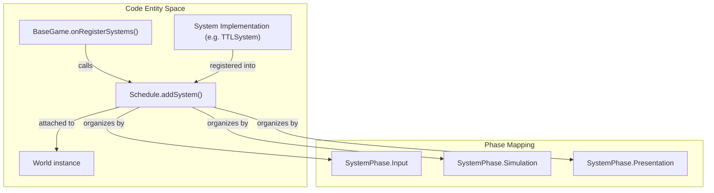
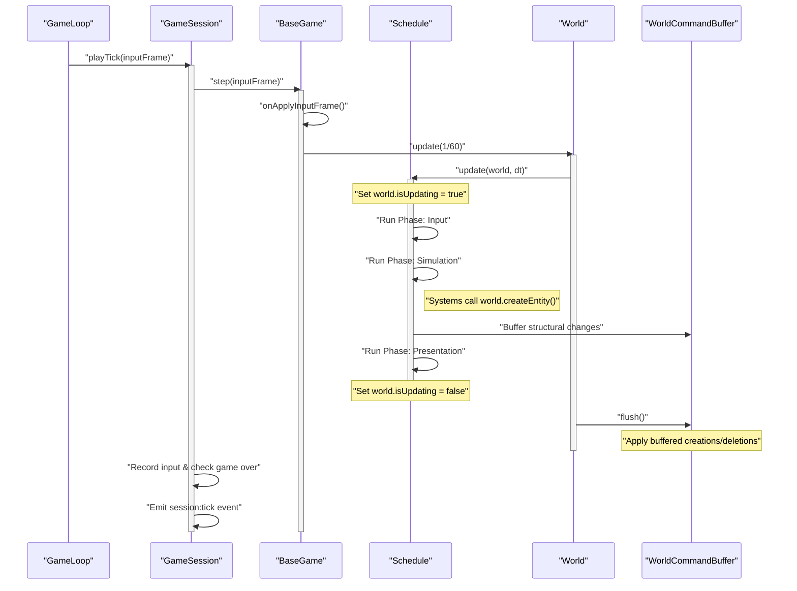

# Schedule, Systems & Game Loop

The TinyAster engine utilizes a deterministic execution pipeline driven by a fixed-timestep game loop. This architecture ensures that gameplay logic remains consistent across different hardware, frame rates, and network conditions. The orchestration of logic is handled by the `Schedule` class, which organizes `System` execution into ordered, logical phases.

## The GameLoop

The `GameLoop` class (`packages/core/src/loop/GameLoop.ts:56`) is a platform-agnostic implementation that decouples the simulation update frequency from the rendering frame rate. It uses an accumulator pattern to ensure that the simulation advances in discrete, fixed steps (defaulting to 1/60s).

### Fixed Timestep Accumulator

Instead of passing a variable `deltaTime` (the time since the last frame) directly to simulation systems—which causes non-deterministic physics and logic—the `GameLoop` consumes time in fixed chunks.

1. **Accumulation**: Real time elapsed is added to an internal accumulator (`packages/core/src/loop/GameLoop.ts:194`).
2. **Consumption**: While the accumulator is greater than the step (e.g., 0.0166s), the loop executes an update tick (`packages/core/src/loop/GameLoop.ts:196-202`).
3. **Interpolation**: Any leftover time is converted into an alpha value (0.0 ≤ alpha < 1.0) passed to render subscribers (`packages/core/src/loop/GameLoop.ts:204-205`), allowing the renderer to smooth out visuals between simulation ticks.

### Spiral of Death Mitigation

If the simulation takes longer to calculate than the real-time step, the accumulator grows indefinitely, leading to a "spiral of death" where the engine tries to catch up by running more updates, further slowing down the frame. TinyAster mitigates this by clamping the maximum `deltaTime` allowed per frame to `maxDelta` (default 0.25s) (`packages/core/src/loop/GameLoop.ts:190-192`).

### Manual Mode & Watchdog

In React Native environments, the engine can run in Manual Mode (`manual: true`) (`packages/core/src/loop/GameLoop.ts:80`). This delegates the `tick()` calls to an external driver, such as a React Native Reanimated `useFrameCallback`. To prevent silent stalls, a Watchdog timer monitors the interval between ticks and logs a warning if the driver stops providing updates for more than 5000ms (`packages/core/src/loop/GameLoop.ts:144-159`).

**Sources:**

- `packages/core/src/loop/GameLoop.ts:40-210`
- `packages/core/src/loop/FrameScheduler.ts:1-20`

---

## Systems & Scheduling

A `System` (`packages/core/src/ecs/System.ts:70`) encapsulates a specific piece of logic (e.g., `PhysicsIntegrateSystem`, `JuiceSystem`). The `Schedule` class (`packages/core/src/ecs/Schedule.ts:27`) manages these systems, ensuring they run in a strict, repeatable order.

### Execution Phases

Systems are assigned to a `SystemPhase` (`packages/core/src/ecs/System.ts:18-31`) which determines their execution order within a single tick:

| Phase        | Purpose                               | Example Systems                       |
| ------------ | ------------------------------------- | ------------------------------------- |
| Input        | Processing raw input and bitmasks.    | `UnifiedInputSystem`                  |
| Simulation   | Core movement and state changes.      | `PhysicsIntegrateSystem`, `TTLSystem` |
| Transform    | Hierarchy and coordinate updates.     | `HierarchySystem`                     |
| Collision    | Detection and resolution.             | `AsteroidCollisionSystem`             |
| GameRules    | High-level logic (scoring, win/loss). | `AsteroidGameStateSystem`             |
| Presentation | Visual feedback and tweens.           | `JuiceSystem`, `ParticleSystem`       |

### Schedule Execution Flow

When `Schedule.update()` is called, it follows a strict lifecycle to maintain ECS invariants:

1. **RNG Unlocking**: Unlocks `world.gameplayRandom` to allow deterministic random calls during the tick (`packages/core/src/ecs/Schedule.ts:117-119`).
2. **Structural Locking**: Sets `world.isUpdating = true` (`packages/core/src/ecs/Schedule.ts:116`). This forces all entity/component mutations into the `WorldCommandBuffer` to prevent array mutation errors during iteration.
3. **Phase Iteration**: Executes systems in order of Phase, then by priority (`packages/core/src/ecs/Schedule.ts:161-182`).
4. **Resource Filtering**: If a `GameplayFreeze` or `IsPaused` resource exists, the schedule skips specific phases (Input, Transform, Collision, GameRules) while allowing Presentation systems to continue running (`packages/core/src/ecs/Schedule.ts:162-167`).

### System Registration Mapping

**Sources:**

- `packages/core/src/ecs/Schedule.ts:8-116`
- `packages/core/src/ecs/System.ts:15-31`
- `packages/core/src/runtime/BaseGame.ts:121-124`

---

## The Game Loop Execution Cycle

The `BaseGame` class (`packages/core/src/runtime/BaseGame.ts:100`) coordinates the relationship between the `GameLoop`, the `World`, and the `Schedule`.

### Simulation Tick Pipeline

### Lifecycle & State

The `ArcadeKernel` (`packages/core/src/runtime/ArcadeKernel.ts:62`) manages the high-level application state (e.g., `BOOT`, `PLAYING`, `PAUSED`) (`packages/core/src/runtime/ArcadeKernel.ts:19-36`). The `BaseGame` synchronizes with this kernel:

- **Pause**: Calling `game.pause()` transitions the kernel to `ArcadeState.PAUSED` and sets the `IsPaused` resource in the ECS World (`packages/core/tests/UnifiedLifecycle.test.ts:68-72`).
- **Game Over**: When a system detects a game-over condition, it emits a `game:over` event (`packages/core/src/events/EventBus.ts:42`), which the `GameSession` (`packages/core/src/runtime/GameSession.ts:17`) or `BaseGame` uses to transition the kernel (`packages/core/src/runtime/GameSession.ts:88-94`).

### Determinism Invariant

To ensure the simulation can be replayed or synchronized over a network:

1. **Stateless Systems**: Systems must not store gameplay state in class properties; all state must reside in Components (`packages/core/src/ecs/System.ts:63-66`).
2. **Seeded RNG**: All randomness must use `world.gameplayRandom` (a seeded LCG), which is only unlocked during the `Schedule` update (`packages/core/src/ecs/Schedule.ts:117-119`).
